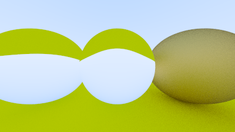

# RayTracingInOneJulia.jl

Work in progress *[Ray Tracing In One Weekend](https://raytracing.github.io/books/RayTracingInOneWeekend.html)* in Julia.

The same code runs both on CPU and on GPU (Nvidia's CUDA).

